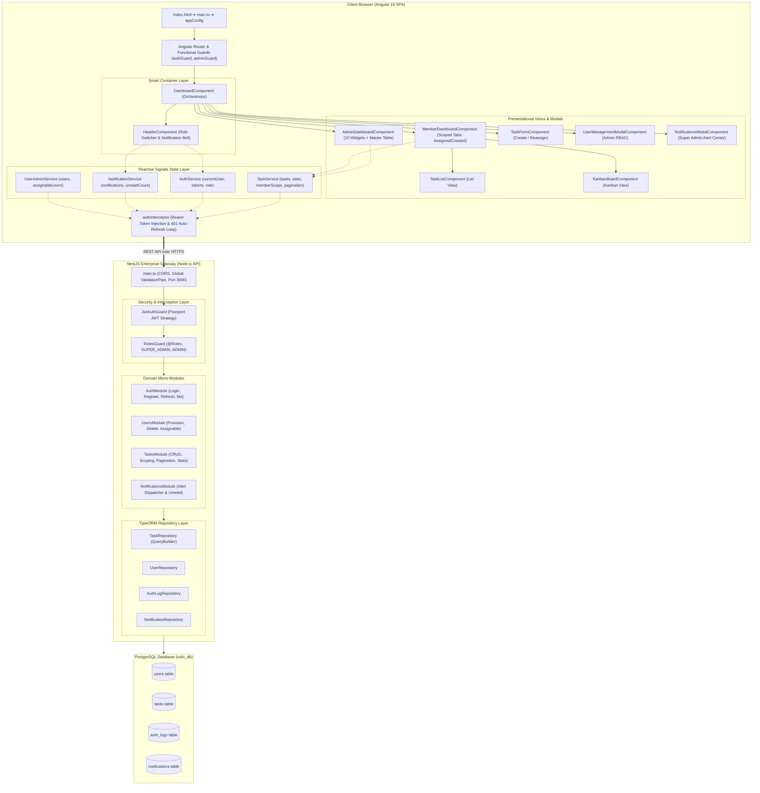
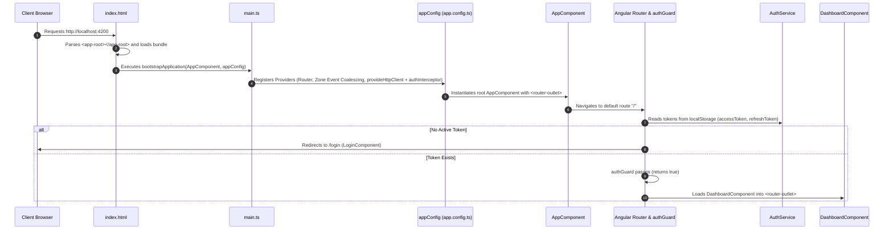
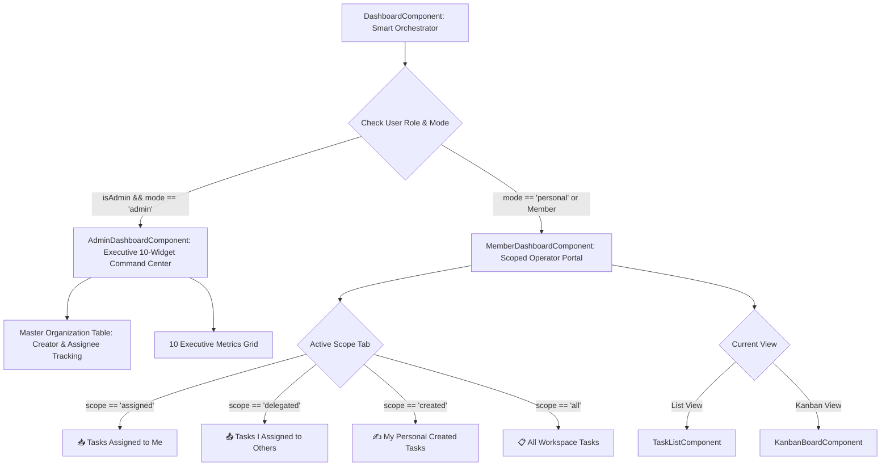
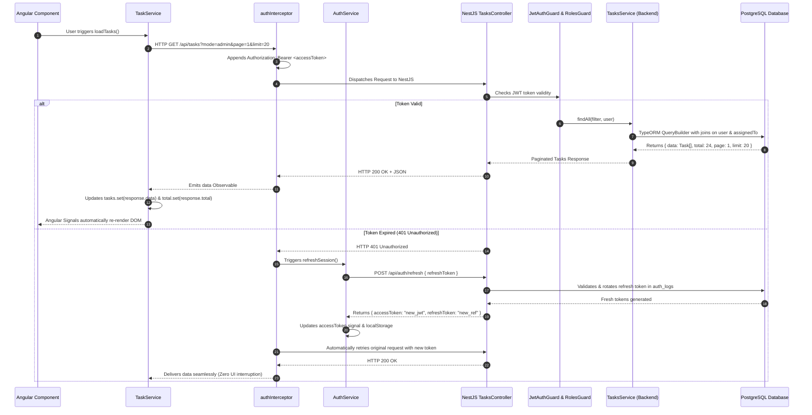
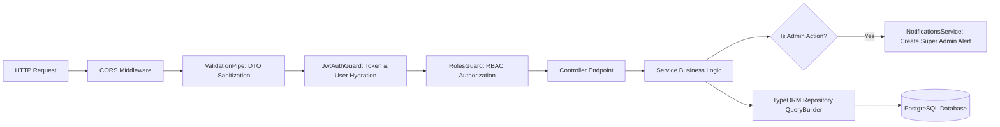

# 🏛️ ApexTodo - Architecture & System Flow Blueprints

This document contains the complete high-resolution architectural diagrams and flowcharts for the **ApexTodo** enterprise platform.

> [!TIP]
> **Interactive & Downloadable HTML Viewer**:
> Open [docs/architecture-diagrams.html](file:///F:/workspace/portfolio/apextodo/docs/architecture-diagrams.html) directly in any web browser to view the diagrams in ultra-crisp vector format with **1-Click "Download Vector SVG"** buttons for every diagram!

---

## 🌐 1. Full-Stack System Architecture Blueprint

---

## 🚀 2. Frontend Bootstrapping & Route Resolution Flow

---

## 🖥️ 3. Dashboard Component & Scoping Hierarchy

---

## 🔄 4. End-to-End Request & Auto-Refresh Flow

---

## 🛡️ 5. Backend Security & Interception Pipeline

